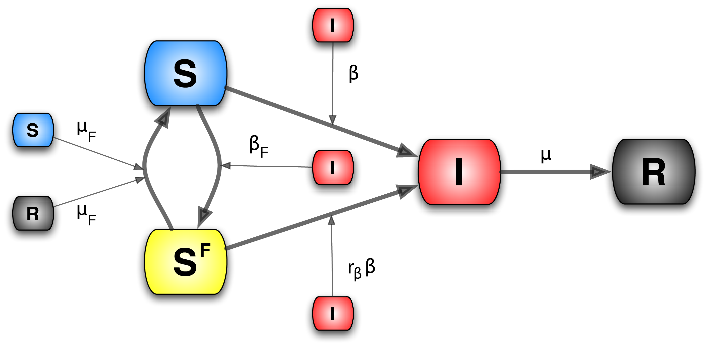
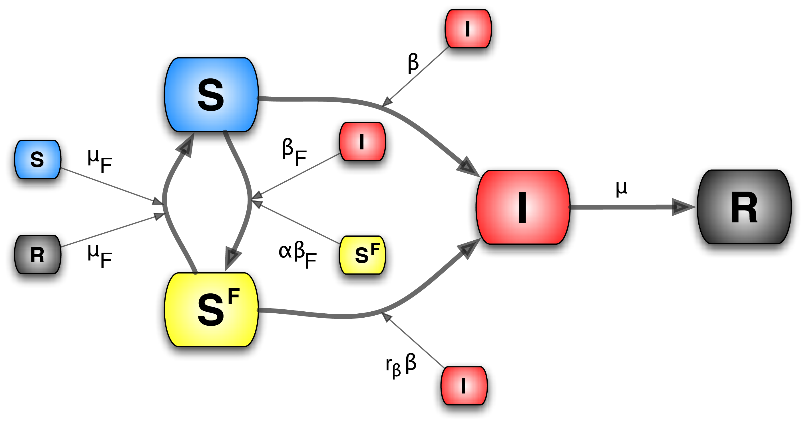

# Behavioral Adaptation to Epidemics: Impact of Awareness on Disease Spread

## Project Overview

This project explores the impact of public awareness on the spread of infectious diseases, using various mathematical models. Our research investigates how awareness, driven by accurate information, social behavior, and media, influences the progression and control of epidemics. The study includes multiple models that assess the effects of both local and global awareness on disease transmission dynamics.

### Contributors
- **Abbas Zal**
- **Sepideh Ghaemifar**
- **Amirhossein Rostami**
- **Supervisor:** Prof. Chiara Poletto, University of Padova, Department of Physics, Life Data Epidemiology Course

## Models Explored

### 1. Local Prevalence-Based Model
This model examines how the local prevalence of a disease influences individuals' behavioral changes, such as adopting protective measures (e.g., mask-wearing, social distancing). The key factors include:
- The probability of individuals relaxing their behavioral changes.
- The level of self-induced behavioral change that reduces the transmission rate.

*Visualized using an Erdos-Renyi graph with varying edge probabilities.*

## Model Visualization

### 2. Global Prevalence-Based Model
This model focuses on how global awareness, typically influenced by media reporting, affects the spread of an epidemic. The characteristic number of infected individuals reported plays a significant role in shaping public behavior.

## Model Visualization

### 3. Local Belief-Based Model
This model evaluates the spread of fear and awareness based on local beliefs, which may or may not align with actual disease prevalence. The model modulates the transmission rate based on contact with either infected individuals or those exhibiting fear-driven behaviors.

## Model Visualization

*All models are implemented in Python, using network-based simulations.*

## Results

Our findings indicate that awareness significantly reduces the severity of disease outbreaks. The effectiveness of awareness is particularly pronounced when proactive measures are taken before the onset of an epidemic. Moreover, the duration and adherence to aware behaviors play a crucial role in controlling the spread of the disease.

## Datasets and Resources

- **[New York Times COVID-19 Data](https://github.com/nytimes/covid-19-data):** Statistics about COVID-19 in the USA.
- **[NYTimes Mask-Wearing Survey](https://www.nytimes.com/interactive/2020/07/17/upshot/coronavirus-face-mask-map.html):** Estimates of mask usage by county in the United States.
- **[Nature Article on Infodemics](https://www.nature.com/articles/s41562-020-00994-6):** Assessing the risks of infodemics during COVID-19.
- **[ResearchGate Article on Media Awareness](https://www.researchgate.net/publication/344602846_The_Impact_of_Media_Awareness_in_Controlling_the_Spread_of_Infectious_Diseases_in_Terms_of_SIR_Model):** Impact of media awareness on infectious disease spread.

## Conclusion

Our study underscores the importance of maintaining high levels of public awareness through accurate information dissemination and social networks. By understanding and leveraging these dynamics, societies can better prepare for and mitigate future epidemics.

## Acknowledgments

We would like to thank Prof. Chiara Poletto for her guidance throughout this project.

